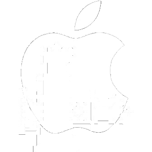

# Op3nWare
Standoff 2 iOS Mod Menu

Работает на какой то старой версии Standoff 2.
Если обновить офсеты и добавить обход античита то все заработает.

Используйте **Theos** для построения.

Шаблон меню взят из: https://github.com/joeyjurjens/iOS-Mod-Menu-Template-for-Theos
Смотрите Readme.MD там.

**Дополнительная информация**

**KittyMemory** изменен и не будет работать без изменений.

[SCLAlertView](github.com/joeyjurjens/iOS-Mod-Menu-Template-for-Theos) не изменен.
